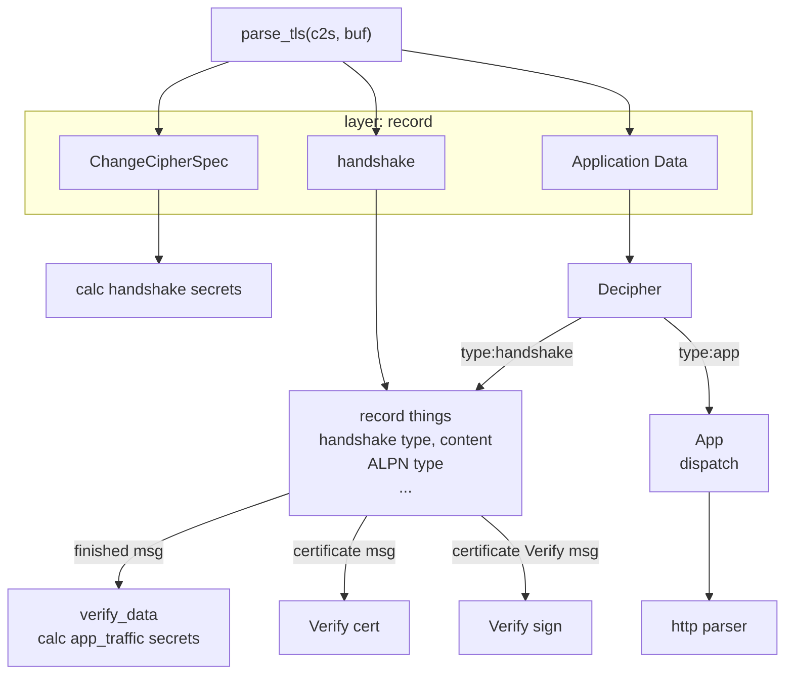

# openssl decode

## Description

input : release\res\packets\s_connect.pcapng,  ECDHE private key of client

output:  index.html

Function: decode TLS traffic


## ECDHE private key

```
const char local_prikey_str[] = "60c436e016e222581407cd72eb98fd81877414960a23041f5b8d2868dbbbe765";
unsigned char local_prikey[32];
str2hex(local_prikey_str, sizeof(local_prikey_str), local_prikey);
```


<p align='center'>

</p>

## Software Architecture




## Installation

command line app:

openssl_dec.exe


## Instructions

OS: windows 10 22H2

IDE: Visual Studio Community 2019

language:  C

Wireshark: 4.6.0

cmake: 4.0.4


| Open Source | version | comments                |
| ----------- | ------- | ----------------------- |
| nginx       | 1.28.0  | https web server        |
| openssl     | 3.5.4   | SDK                     |
| libpcap     | 1.10.5  | parse Wireshark packets |
| npcap       | 1.15    | used to compile libpcap |
| llhttp      | 9.3.0   | parse http header       |

