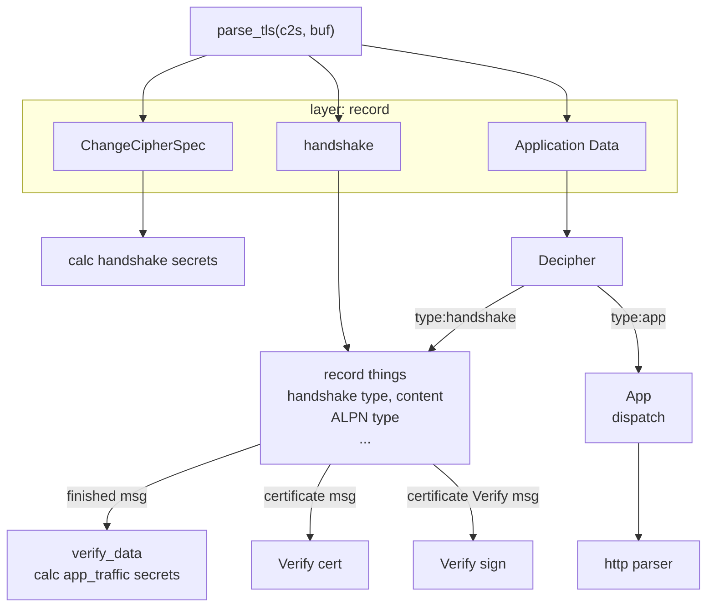
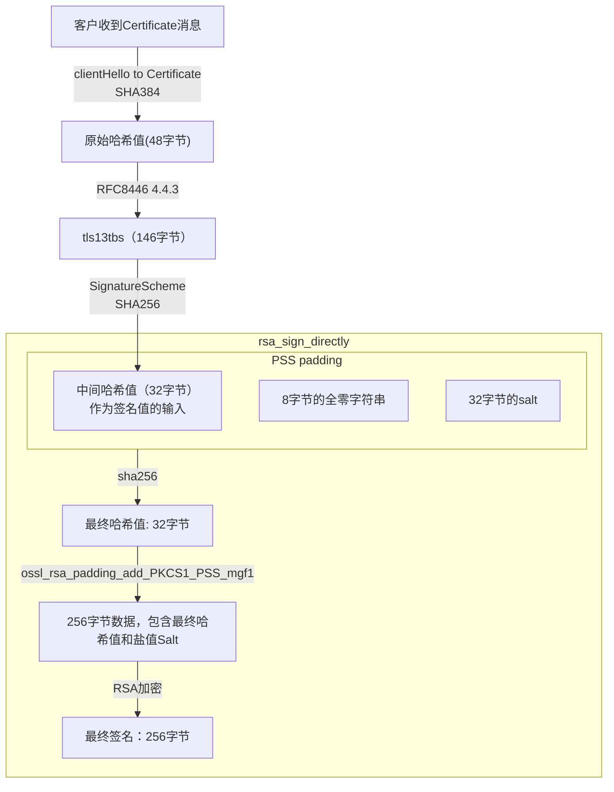
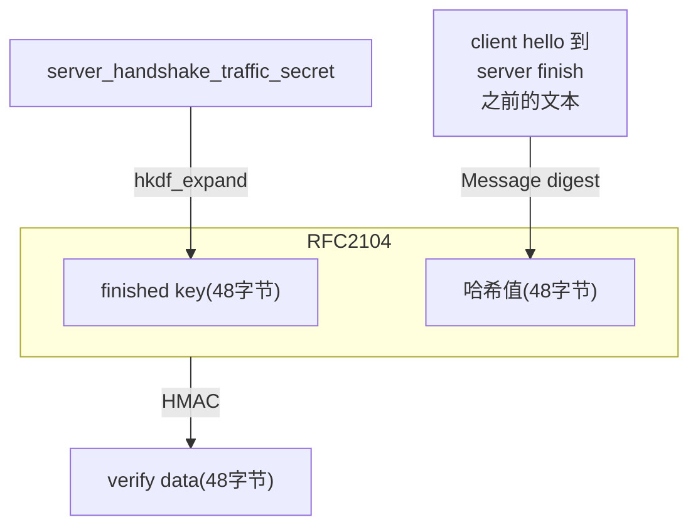

# 项目总结

本文档采用 Typora 1.12.2 撰写。

总结 openssl-dec 项目。


# 项目简介


## 开发环境

运行平台： windows 10 专业版 （版本 22H2）

开发工具：VS2019 社区版

开发语言：C 语言

Wireshark：4.6.0， 抓包分析工具

cmake：4.0.4，编译工具


| 开源代码 | 版本   | 备注                           |
| -------- | ------ | ------------------------------ |
| nginx    | 1.28.0 | https 服务器，可执行程序       |
| openssl  | 3.5.4  | SSL 协议，网站下载编译好的SDK  |
| libpcap  | 1.10.5 | 源代码编译，动态链接库         |
| npcap    | 1.15   | 网站下载 SDK，用于编译 libpcap |
| llhttp   | 9.3.0  | 解析 http 头，静态链接库       |


最终的可执行程序：openssl_dec.exe

功能：openssl 解密https 包

项目初衷：学习 openssl 开源库，学习 TLS 通讯协议


## 使用

命令行程序。

程序输入：release\res\packets\s_connect.pcapng ， 客户端ECDHE私钥（写在代码中）

程序功能：测试从 ECDHE 私钥到最终密钥的计算，解密 https

程序输出： index.html

程序输出是否正确，可以和 release\res\other\index.html  对比。

两个文件一样，则输出正确。


# 项目输入

程序输入：release\res\packets\s_connect.pcapng ， 客户端ECDHE私钥（写在代码中）


## https包

文件 **s_connect.pcapng** 是 Wireshark 抓包的结果。

运行 nginx 服务器，命令行运行：

```text
nginx.exe
```


openssl 命令下载网页，命令行运行：

```bash
printf 'GET %s HTTP/1.1\r\nHost: %s\r\nConnection: close\r\n\r\n' / localhost | openssl s_client -quiet -connect localhost:443 -keylogfile wireshark_keys.log
```

Wireshark 看起来是这样：

```http
Hypertext Transfer Protocol
    GET / HTTP/1.1\r\n
    Host: localhost\r\n
    Connection: close\r\n
    \r\n
    [Response in frame: 90]
    [Full request URI: https://localhost/]
```


Wireshark 捕获接口：本地 loopback 接口

过滤条件：抓包后，看哪个 TCP 端口和 443 通讯，就用哪个 TCP 端口作为过滤条件

例如，看到 TCP 端口是 12768，则过滤条件如下：

```text
(tcp.srcport == 12768 || tcp.dstport == 12768) and tls
```

wireshark ：文件 - 导出特定分组 - 仅选中分组，保存为文件：

**s_connect.pcapng**：加密的 https 通讯，就是本项目的输入文件之一。


## ECDHE私钥

客户端ECDHE私钥：

```c
//ecdhe local private key(32B) 60c436e016e222581407cd72eb98fd81877414960a23041f5b8d2868dbbbe765
const char local_prikey_str[] = "60c436e016e222581407cd72eb98fd81877414960a23041f5b8d2868dbbbe765";
unsigned char local_prikey[32];
str2hex(local_prikey_str, sizeof(local_prikey_str), local_prikey);
```

私钥来源：修改 openssl 源代码，打印私钥信息。

openssl-3.5.4/crypto/ec/ecx_key.c

```c
int ossl_ecx_compute_key(ECX_KEY *peer, ECX_KEY *priv, size_t keylen,
                         unsigned char *secret, size_t *secretlen, size_t outlen)
{
    if (keylen == X25519_KEYLEN) {
        if (ossl_x25519(secret, priv->privkey, peer->pubkey) == 0) {
            ERR_raise(ERR_LIB_PROV, PROV_R_FAILED_DURING_DERIVATION);
            return 0;
        }
		printf("%s: %d\n", __FILE__, __LINE__);
		print_hex("ecdhe local private key(32B) ", priv->privkey, 32);
		print_hex("ecdhe peer  public  key(32B) ", peer->pubkey, 32);
    }
	//...	
}

打印结果：
crypto\ec\ecx_key.c: 162
ecdhe local private key(32B) 60c436e016e222581407cd72eb98fd81877414960a23041f5b8d2868dbbbe765
ecdhe peer  public  key(32B) df36682fdaee3c8a0d82ecd3307e7f5c1859c4717e64b5b5a1f7e02aa5c6b946
ecdhe pre-master secret(32B) 0c8e6ff0577cf91cc177cc380ffa1bc9178893fcfaa2c36754366f1a9d1f8201
```

openssl 在收到 server hello 握手包后，开始计算预备主密钥时，用到本地的 ECDHE 私钥和服务器的 ECDHE公钥。

tls_process_server_hello -> tls_parse_all_extensions -> tls_parse_extension

-> tls_parse_stoc_key_share -> ssl_derive -> ecx_derive -> ossl_ecx_compute_key


# 项目功能

openssl 开源库主要实现了2个功能：

| 库名称    | 动态链接库          | 功能         |
| --------- | ------------------- | ------------ |
| libcrypto | libcrypto-3-x64.dll | 密码学       |
| libssl    | libssl-3-x64.dll    | SSL/TLS 协议 |

本项目只用到了 libcrypto，即加密和解密功能。

项目实现了以下3个功能：

## **1 - TLS 协议解析**

需要阅读相关 RFC。

这一部分完全自己完成，无需 openssl 开源库。


## **2 - 解密 https 包**

这是本项目最难的部分。

需要生成4个哈希值，8个中间密钥，8个最终密钥（会话密钥）。

8个中间密钥：

1. Pre-Master Secret（PMS）：预备主密钥
2. Early Secret
3. Handshake Secret
4. Master Secret
5. client_handshake_traffic_secret
6. server_handshake_traffic_secret
7. client_application_traffic_secret
8. server_application_traffic_secret

这8个中间密钥，又生成8个最终密钥，即会话密钥。

一共16个密钥。

有了会话密钥，就可以解密 https。

<p align='center'>

</p>


## **3 - 证书**

解析 x509证书，提取公钥，签名值等信息；

生成证书签名，验证证书签名；

生成握手签名，验证握手签名。


# 开发周期

整个项目，花费 4周。

2周：解析 TLS 协议，计算各种密钥

1周：TLS 证书

1周：写文档


# 开发难度

| 源代码位置              | 源代码         | 代码行数   |
| ----------------------- | -------------- | ---------- |
| crypto\x509， 证书      | 104个文件      | 3万行      |
| crypto\asn1，证书编解码 | 69个文件       | 1.6万行    |
| 证书相关代码总计        | 将近 200个文件 | 将近 5万行 |
| openssl 3.5.4 代码总计  | 2200个文件     | 33万行     |

从这33万行代码中，和openssl 难懂的帮助文档中，找到相应的程序接口，不容易。

何况 openssl 帮助文档的网站，打开和查找很慢。

[ossl-guide-libraries-introduction - OpenSSL Documentation](https://docs.openssl.org/3.5/man7/ossl-guide-libraries-introduction/)


------

# 项目实现

项目功能：解析 https 包

项目输出：index.html


## 流程图

整个项目流程图如下：




握手签名算法流程图：这是证书功能的一部分。



看着就不简单。


## 主要数据结构


**会话密钥**

```c
struct final_secret {
	unsigned char key[EVP_MAX_KEY_LENGTH];
	unsigned char iv[EVP_MAX_IV_LENGTH];
	uint64_t seq;
};
```


**https加密和解密**

```c
struct tls_cipher {
	int type; //AES_256_GCM, etc.

	OSSL_LIB_CTX* lib_ctx;
	EVP_CIPHER_CTX* ctx;
	EVP_CIPHER* cipher;
	
	//in
	unsigned char key[EVP_MAX_KEY_LENGTH];
	size_t key_len;
	unsigned char iv[EVP_MAX_IV_LENGTH];
	size_t iv_len;
	//TLS 1.3 AAD = type 1B || version 2B || length 2B
	unsigned char aad[32]; //max 32B
	size_t aad_len;
};
```


一次 **TLS 连接**，需要记录以下信息：

```c
struct parse_info {
	unsigned char* prikey;

	//digest calc
	char handshake_buf[MAX_HANDSHAKE_LEN];
	int handshake_len;
	struct digest_content mdc[MAX_RECORD_NUM]; //message digest calc
	int mdc_cnt; //0 based

	struct tls_cipher* enc; //Encryption and decryption

	u_int cipher_suite; //default: TLS_AES_256_GCM_SHA384 (0x1302)
	u_int group;
	char* server_pub_key;
	u_int server_pub_key_len;

	u_int hash_len;
	//secrets
	int mid_secrets_done; //finished cal handshake_traffic_hash and 4 secrets
	unsigned char pms[X25519_KEYLEN]; //pre-master key
	unsigned char early[EVP_MAX_MD_SIZE];
	unsigned char handshake[EVP_MAX_MD_SIZE];
	unsigned char master[EVP_MAX_MD_SIZE];

	unsigned char handshake_traffic_hash[EVP_MAX_MD_SIZE];
	int handshake_traffic_hash_done;

	unsigned char server_finished_hash[EVP_MAX_MD_SIZE];
	int server_finished_hash_done;

	int handshake_secrets_done; //finished cal handshake_traffic_secret
	int app_secrets_done; //finished cal application_traffic_secret

	//server_handshake_traffic_secret: shts
	unsigned char shts[EVP_MAX_MD_SIZE];
	struct final_secret shts_keys;

	//client_handshake_traffic_secret: chts
	unsigned char chts[EVP_MAX_MD_SIZE];
	struct final_secret chts_keys;

	//server_application_traffic_secret_0: sats
	unsigned char sats[EVP_MAX_MD_SIZE];
	struct final_secret sats_keys;

	//client_application_traffic_secret_0: cats
	unsigned char cats[EVP_MAX_MD_SIZE];
	struct final_secret cats_keys;

	//cert
	char* cert;
	int cert_len;

	//http parser
	llhttp_t parser;
	llhttp_settings_t settings;
};

```


## 生成密钥

函数接口简介

| 函数接口             | 用途              | 输入参数                         | 输出值            |
| -------------------- | ----------------- | -------------------------------- | ----------------- |
| 密钥函数             |                   |                                  |                   |
| create_x25519_key    | 生成ECDHE 私钥    | 32字节私钥值                     | EVP_PKEY 私钥指针 |
| cal_x25519_secret    | 生成预备主密钥    | 自己的ECDHE私钥，对方的ECDHE公钥 | Pre-Master serect |
| tls_early_serect     | 生成早期密钥      | 哈希算法，例如 SHA256, SHA384    | early serect      |
| tls_handshake_serect | 生成握手密钥      | 哈希算法，早期密钥，预备主密钥   | Handshake serect  |
| tls_master_serect    | 生成主密钥        | 哈希算法，握手密钥               | Master serect     |
| tls13_hkdf_extract   | HKDF extract 算法 | 哈希算法，salt, IKM              | 中间密钥          |
| tls13_hkdf_expand    | HKDF expand 算法  | 哈希算法，中间密钥，标签         | 会话密钥          |
| derive_secret        | 封装HKDF expand   | 哈希算法，中间密钥，标签         | 会话密钥          |
| tls13_derive_key     | 生成最终密钥      | 哈希算法，中间密钥               | 密钥              |
| tls13_derive_iv      | 生成最终密钥      | 哈希算法，中间密钥               | 密钥向量          |
| hmac_verify_data     | 计算verify data   | 完成密钥，完成哈希值             | verify data       |
| calc_secrets_ext     | 生成最终密钥      | 哈希算法，中间密钥，标签         | 会话密钥          |


## 其它函数

| 摘要函数                 | 用途             | 输入参数                       | 输出值         |
| ------------------------ | ---------------- | ------------------------------ | -------------- |
| digest_init              | 初始化摘要计算   | 哈希算法，例如 SHA256, SHA384  | 上下文指针     |
| digest_exit              | 释放摘要计算资源 | 摘要计算上下文指针             | 无             |
| EVP_DigestUpdate         | 设定摘要输入     | 上下文指针，输入文本内容       | 成功返回1      |
| EVP_DigestFinal          | 计算摘要值       | 上下文指针                     | 摘要值         |
| AES加密/解密             | 解密 https       |                                |                |
| tls_cipher_init          | 初始化           | 加密类型：例如 AES_256_GCM     | 上下文指针     |
| tls_cipher_set           | 设定参数         | key, iv, aad                   | 无             |
| aes_gcm_enc              | 加密             | 上下文指针，明文               | 密文和tag      |
| aes_gcm_dec              | 解密             | 上下文指针，密文，tag          | 明文和验证结果 |
| tls_cipher_exit          | 释放资源         | 上下文指针                     | 无             |
| RSA加密和解密            |                  |                                |                |
| rsa_get_key_fromfile     | 从文件得到密钥   | 文件名，文件格式，公钥还是私钥 | EVP_PKEY指针   |
| ras_encrypt_key          | RSA 加密         | 公钥指针，明文                 | 密文           |
| rsa_decrypt_key          | RSA 解密         | 私钥指针，密文                 | 明文           |
|                          |                  |                                |                |
| 证书签名                 | 以下是           | 证书相关函数                   |                |
| rsa_sign                 | 生成证书签名     | 私钥指针，证书TBS哈希值        | 签名值         |
| rsa_verify_sign          | 验证证书签名     | 公钥指针，签名值               | 成功返回1      |
| 握手签名                 |                  |                                |                |
| rsa_sign_pss             | 生成握手签名     | 私钥指针，握手哈希值           | 签名值         |
| rsa_verify_sign_pss      | 验证握手签名     | 公钥指针，握手哈希值，签名值   | 成功返回1      |
| get_cert_verify_tbs_data | 填充哈希         | 哈希值                         | 填充结果       |


注：

**1 - calc_secrets_ext** 是对 derive_secret， tls13_derive_key， tls13_derive_iv 的简单封装。

一次性生成所有会话密钥。


**2 - AES_GCM** 加密和解密流程，这里需要解密 https，用到了 aes_gcm_dec();

```c
tls_cipher_init();
tls_cipher_set();

aes_gcm_enc();
aes_gcm_dec();

tls_cipher_exit();
```


**3 - get_cert_verify_tbs_data**，填充哈希

[RFC 8446: The Transport Layer Security (TLS) Protocol Version 1.3](https://www.rfc-editor.org/rfc/rfc8446.html)

4.4.3.  Certificate Verify

```
The content that is covered
   under the signature is the hash output as described in Section 4.4.1,
   namely:
      Transcript-Hash(Handshake Context, Certificate)

   The digital signature is then computed over the concatenation of:

   -  A string that consists of octet 32 (0x20) repeated 64 times
   -  The context string ("TLS 1.3, server CertificateVerify")
   -  A single 0 byte which serves as the separator
   -  The content to be signed
```

根据如上协议，填充哈希值。实现这个协议的函数：get_cert_verify_tbs_data


## verify data 

计算流程如下



